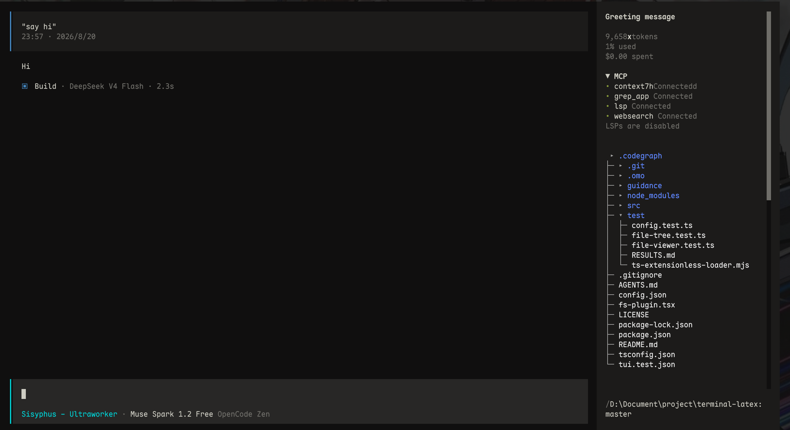
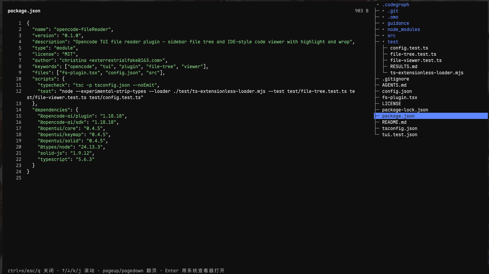

# opencode-fileReader — Opencode 文件浏览插件

在 Opencode TUI 右侧边栏查看项目文件，并在主视口以 IDE 式左右分栏阅读代码（支持目录折叠、隐藏文件可见、轻量着色、超长行自动折行）。



*实际使用截图由作者提供*

## 环境要求

- 已安装 `opencode` 1.18+

验证：

```powershell
opencode --version
```

未安装：

```powershell
npm i -g opencode
# 或
bun add -g opencode
```

## 安装

```powershell
git clone https://github.com/exterrestialfake/opencode-fileReader.git
```

克隆后无需额外安装依赖即可直接使用 — 插件通过 `file://` 由 Opencode 直接加载，运行时所需的 `@opencode-ai/plugin` 由宿主在 `.opencode` 目录自动安装、`@opentui/*` 等由宿主桥接提供。

## 快速开始（推荐）

**方式一：临时配置OPENCODE_TUI_CONFIG**

### Windows PowerShell

在 Windows PowerShell 5.1 或 PowerShell 7 中，通过调用运算符在当前会话执行脚本：

```powershell
& "D:\path\to\opencode-fileReader\setup-opencode.ps1"
Set-Location "\path\to\your-project"
opencode
```

脚本会校验 `tui.test.json` 和插件入口，再设置当前 PowerShell 进程的 `OPENCODE_TUI_CONFIG`；脚本本身不会启动 `opencode`。

### POSIX/Bourne Shell

在 POSIX/Bourne Shell（`sh`、`bash`、`zsh`、`dash`、`ksh`）中执行以下命令。脚本会校验 `tui.test.json` 和插件入口，并输出 OpenCode TUI 配置文件的绝对路径；当前 Shell 通过命令替换将该路径导出为 `OPENCODE_TUI_CONFIG`。

```bash
export OPENCODE_TUI_CONFIG="$(sh /path/to/opencode-fileReader/setup-opencode.sh)"
cd /path/to/your-project
opencode
```

脚本的标准输出只有解析后的配置路径，因此可安全用于上述命令替换；校验错误会写入标准错误。必须在同一个 Shell 会话中设置变量并启动 `opencode`，但脚本本身不会启动 `opencode`。

如需确认变量，可在启动 TUI 前执行：

```bash
printenv OPENCODE_TUI_CONFIG
```

**方式二：写入全局 tui.json（尚未充分测试，暂不推荐）**

```json
{
  "$schema": "https://opencode.ai/tui.json",
  "plugin": ["file:///D:/path/to/opencode-fileReader/fs-plugin.tsx"]
}
```

> 已有 `plugin` 数组请追加一项，不要覆盖现有插件（如 `oh-my-openagent`）。

## 使用

- **浏览**：鼠标点击目录可折叠/展开，点击文件可在分栏中打开；再次按 `ctrl+o` 或 `esc/q` 返回
- **滚动**：在代码区使用 `up/k`、`down/j`、`pageup`、`pagedown` 滚动；超长行会自动换到下一行显示
- **图像/二进制**：选中 `png/jpg` 等图像会显示文件名/大小/尺寸，按 `Enter` 用系统查看器打开原图

## 快捷键

可在 `tui.json` 中通过 `keybinds` 覆盖任意键（键名即下表左侧）。

| 功能 | 默认键 | 说明 |
| --- | --- | --- |
| 显隐文件树 | `ctrl+b` | 开/关右侧文件树 |
| 打开/关闭文件 | `ctrl+o` | 选中文件时打开；在阅读页内再次按 `ctrl+o` 关闭返回 |
| 关闭阅读页 | `esc, q` | `ctrl+o` 的备选 |
| 上/下滚动 | `up,k` / `down,j` | |
| 上/下翻页 | `pageup` / `pagedown` | |
| 系统打开 | `enter,return` | 二进制/图像用系统查看器打开 |

覆盖示例：

```json
{
  "plugin": [
    ["file:///D:/path/to/opencode-fileReader/fs-plugin.tsx", {
      "keybinds": {
        "fs.toggle": "ctrl+shift+b",
        "fs.open": "ctrl+o"
      }
    }]
  ]
}
```

所有可覆盖的键名见 `config.json`。

## 配置

- 快捷键默认值集中在 `config.json`，插件会将 `tui.json` 中传入的 `keybinds` 与其合并
- 文件树默认仅展开根目录，隐藏文件默认可见，无需额外开关

## 常见问题

**快捷键在输入框获焦时无效？**
本插件的 `fs.toggle` / `fs.open` 已注册为全局层，在输入框获焦时仍可触发；若与你现有键位冲突，请在 `tui.json` 中用 `keybinds` 改键。

**执行脚本后仍看不到文件树？**
确认 PowerShell 中的 `$env:OPENCODE_TUI_CONFIG` 或 POSIX Shell 中的 `printenv OPENCODE_TUI_CONFIG` 输出了 `tui.test.json` 的绝对路径；请使用快速开始中的 PowerShell 调用命令或 POSIX `export` 命令，并在同一 Shell 会话启动 `opencode`。

**看不到侧边栏？**
阅读页采用路由内左右分栏（左代码右树）实现，即使宿主在自定义路由下不渲染侧边栏，树仍会在阅读页右侧复现。

## 许可证

MIT — 见 [LICENSE](LICENSE)
